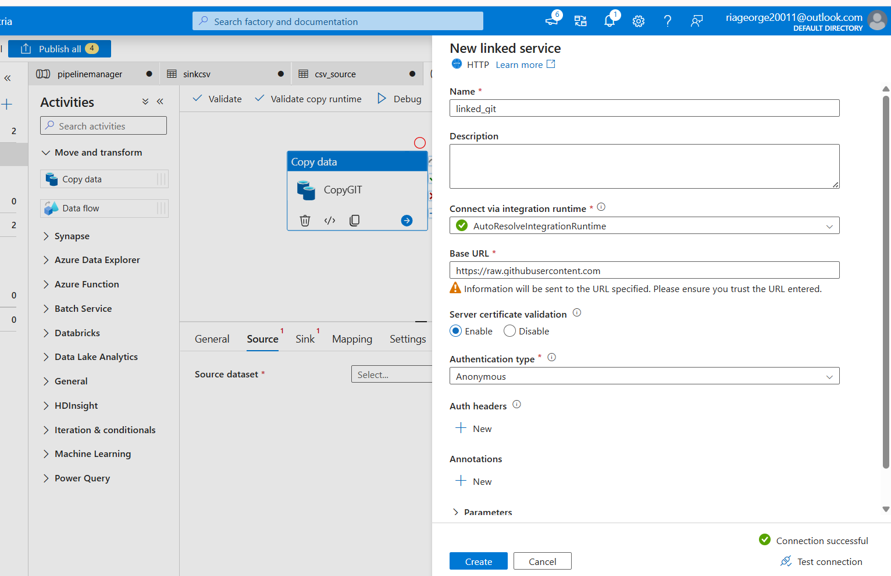
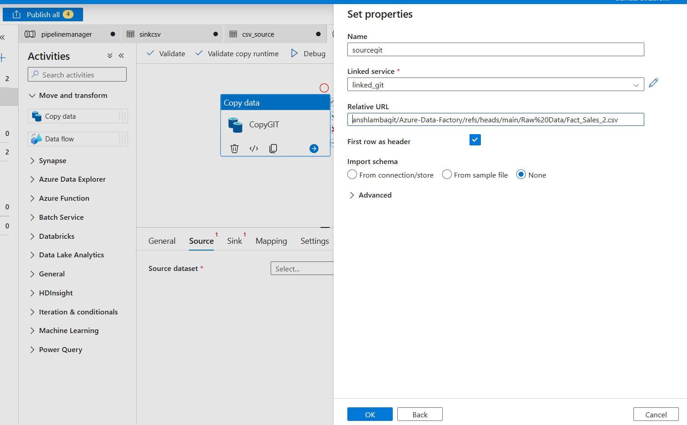
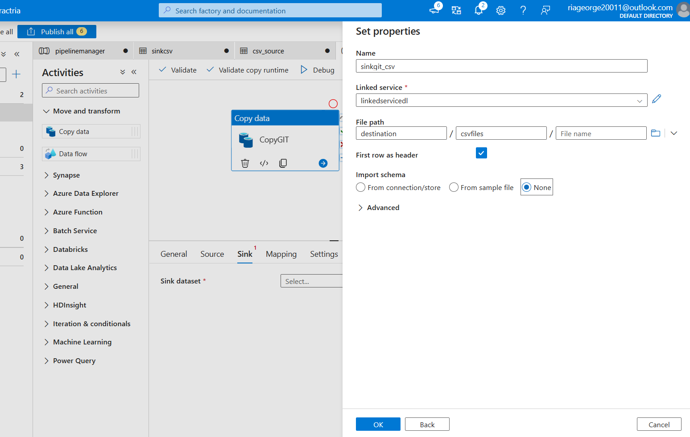
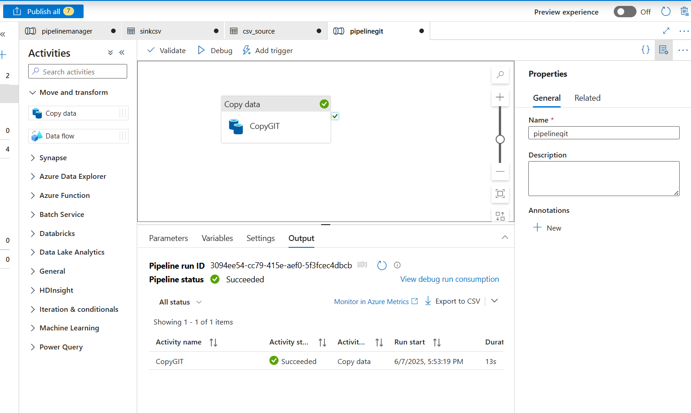
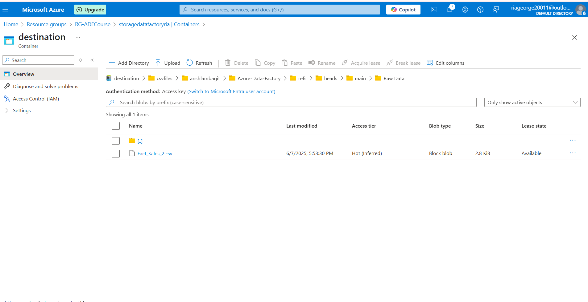
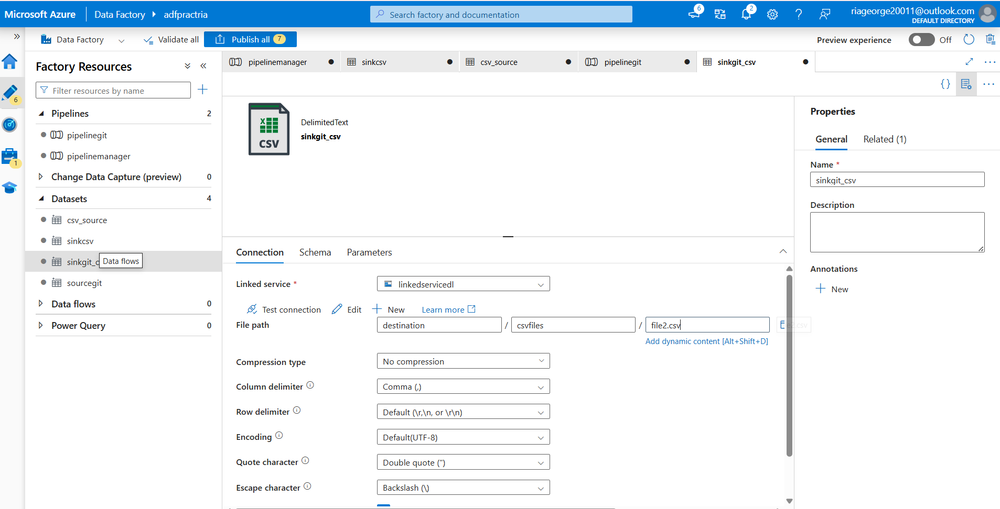
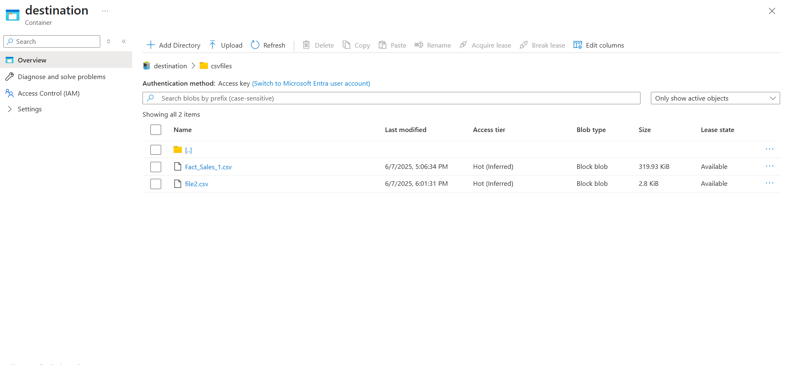

# 📘 Lesson 4: Copy Data from GitHub (HTTP) to Data Lake

## 🎯 Objective
Pull CSV data directly from a public GitHub API (HTTP URL) and copy it into Azure Data Lake Gen2 using Azure Data Factory.
We already have created linked service for data lake *linkedservicedl* in lesson 3
But we have to create sink dataset as only linked service for the sink has been created.

---

## 🔧 Pipeline Details

📄 **JSON File**: [pipeline_http_to_datalake.json](pipeline_http_to_datalake.json)

---

## 🔄 Activity: Copy CSV from HTTP

| Property             | Value                          |
|----------------------|--------------------------------|
| **Activity Name**    | `CopyGIT`             |
| **Source Type**      | HTTP (GitHub API)              |
| **Relative URL**     | `anshlambagit/Azure-Data-Factory/refs/heads/main/Raw%20Data/Fact_Sales_2.csv` |
| **Authentication**   | Anonymous (Public)             |
| **Sink Type**        | Azure Data Lake Gen2           |
| **Container**        | `destination`                          |
| **Folder Path**      | `destination/csvfiles`            |

---

## 🧱 Datasets & Linked Services

### 🔹 Source Dataset: HTTP
- Type: HTTP
- Format: DelimitedText (CSV)
- Linked Service: `linked_git` (created new)
                - Base URL : `https://raw.githubusercontent.com`
                - Authentication type : Anonymous
- Relative URL: `anshlambagit/Azure-Data-Factory/refs/heads/main/Raw%20Data/Fact_Sales_2.csv`
- First row as header : Enabled
- Import schema : None
- Request Method: `GET`

### 🔸 Sink Dataset: Data Lake
- Type: Azure Data Lake Gen2
- Format: DelimitedText
- Linked Service: `linkedservicedl`
- Folder Path: `destination/csvfiles`

---

## 🖼️ Screenshot

- Linked service to connect to git

  !

- Source Dataset

  

- Sink Dataset 

  

- Pipeline run successfully

  

- Validation of uploaded files in destination container

  

- To avoid all folder name replication from git, edit and mention desired vfilename in the sinkgit_csv dataset

  

  

---

## ✅ Steps Performed

1. Created an HTTP Linked Service for GitHub (public URL).
2. Created a DelimitedText dataset using relative path.
3. Set up Data Lake Linked Service for sink.
4. Built a simple Copy Data activity in the pipeline.
5. Debug ran the pipeline successfully.

---

## 🗒️ Notes

- This process avoids manual CSV uploads by directly pulling from online sources.
- Make sure the GitHub file is public or accessible anonymously.
- In a real use case, use parameterized URLs if pulling dynamic files.

---

