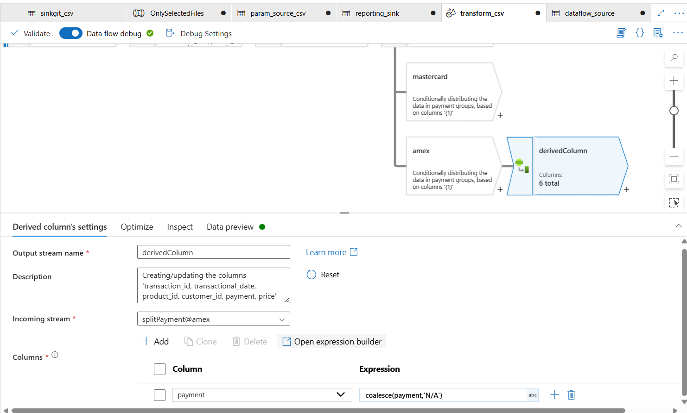

### Lesson 5: Data Transformation using Data Flows + Triggering Pipeline

---

#### 🔁 Previous Logic Recap
**Pipeline Flow:**
- Get Metadata → ForEach → If Condition → Copy only files starting with `Fact`

---

#### 🧠 Objective:
1)Apply transformations on the copied files using **Data Flows** and trigger the pipeline automatically using **Triggers**.

2)Stream Processing & Conditional Splits: Creating multiple data streams using conditional splits (e.g., separating data by payment methods like MasterCard, American Express) within data transformation pipelines )

---

#### 🔧 Data Flow Setup

| Property                 | Value / Choice                                 |
|--------------------------|------------------------------------------------|
| **Data Flow Name**       | `Data_Transformation`                      |
| **Source Dataset**       | Point to copied CSV file in secure container   |
| **Transformations**      | - Select 6 Columns  - Filter  - Conditional split   - Derive new column   - Aggregate| 
| **Sink**                 | [`dataflow_sink`] A dataflow folder within the reporting container(to store the transformed data) |
| **Data Flow Debug**      | Enabled                                        |

---

#### ⚙️ Trigger Configuration

| Property             | Value                              |
|----------------------|-------------------------------------|
| **Trigger Type**     | Scheduled                           |
| **Trigger Name**     | `selectedFilesTrigger`            |
| **Start Time**       | `6/8/2025, 1:35:46 AM`               |
| **Recurrence**       | e.g., every 1 hour (if scheduled)   |
| **Associated Pipeline** | Connect this to main pipeline     |

---

## 🔁 Workflow Screenshot

- In the dataflow canvas -> Settings -> Create a new dataset for this data flow ->File path = reporting/csvfiles

- Turn on the cluster

- Import Project -> To import the schema

- Data Preview

- The list of transformation functions

- Select 6 cols

- Filter data : discard cusid = 12

- Split data based on  Payment type (visa , mastercard , amex)

- Apply `Derived Column` [to transform a col or add a new col] to remove null values in amex category

- Apply groupBy(`Aggregate`)
 
    - GroupyBy Customer id
    

    - Max of prod id
    

    - Data preview [The max prod it based on each customer id]
    

 - Use AlterRows b4 Sink (allows to perform insert , update, upsert. esp delaimg with dbs and data warehouses)
 [*Insert all records*]
 
 [*esp useful if we only want to insert data for prod_id == 1, etc]

- Select sink after aggregation to write the transformed data

- Here we ignored writing data pf mastercard and amex stream to a sink. Only the o/p of visa is written to a sink.

- Add a trigger

- Trigger Activated

- Pipeline executed successfully

- Output

---  

#### 📈 Outcome
- Only `Fact_*.csv` files are copied.
- Applied transformations such as:
  - Row number using window functions.
  - Column cleanup / renaming.
  - Filtering or data formatting.
- Pipeline runs automatically as per the trigger.

---

#### 📂 JSON File Reference:
- [lesson5_dataflow_transform_fact.json](./lesson5_dataflow_transform_fact.json)

