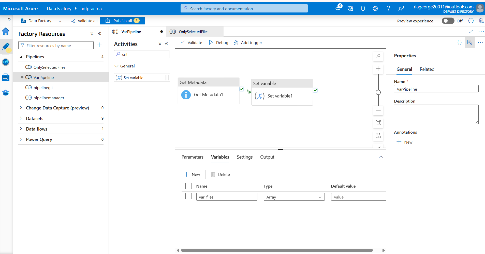
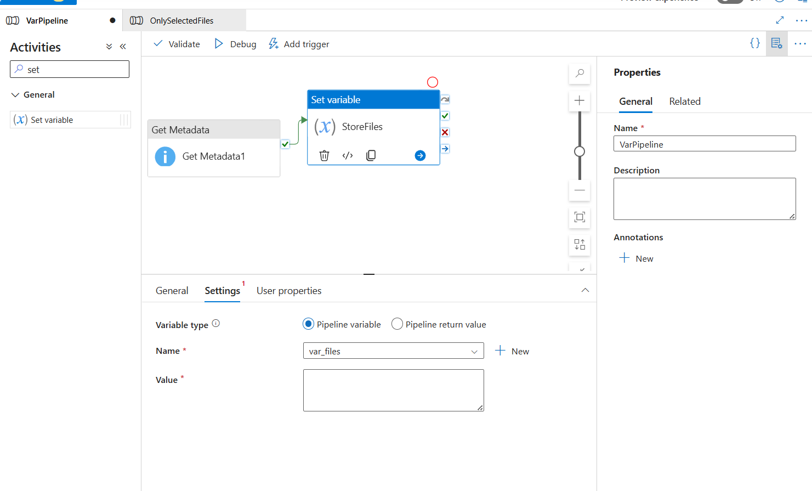
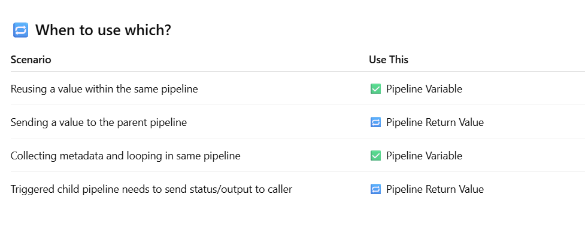
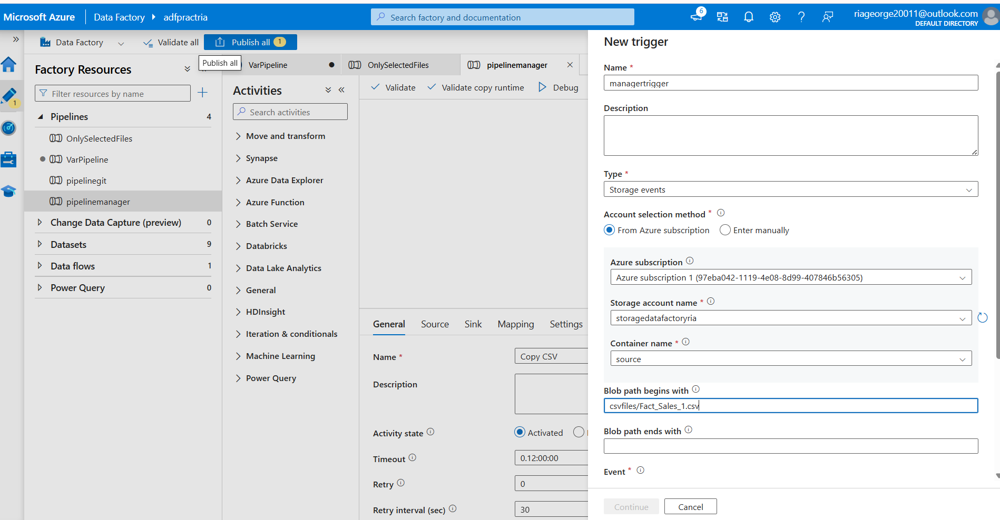
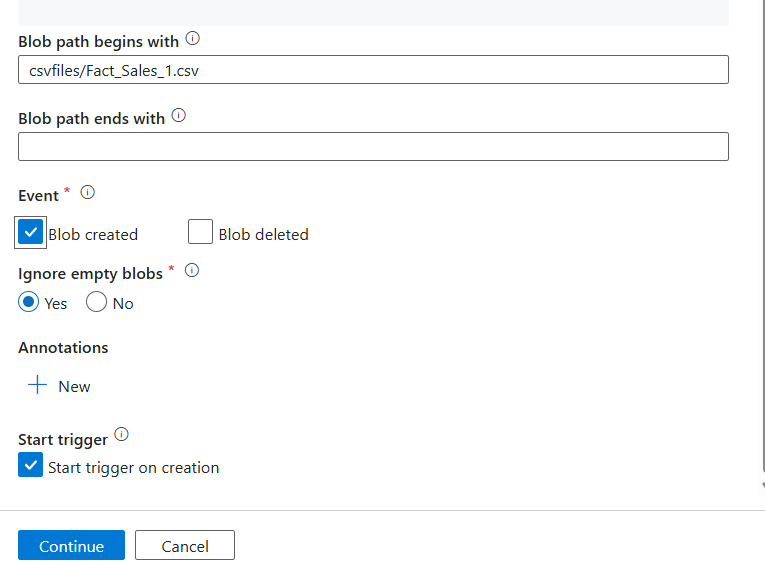
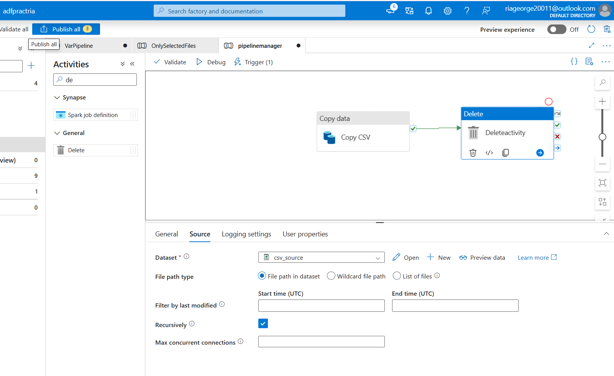
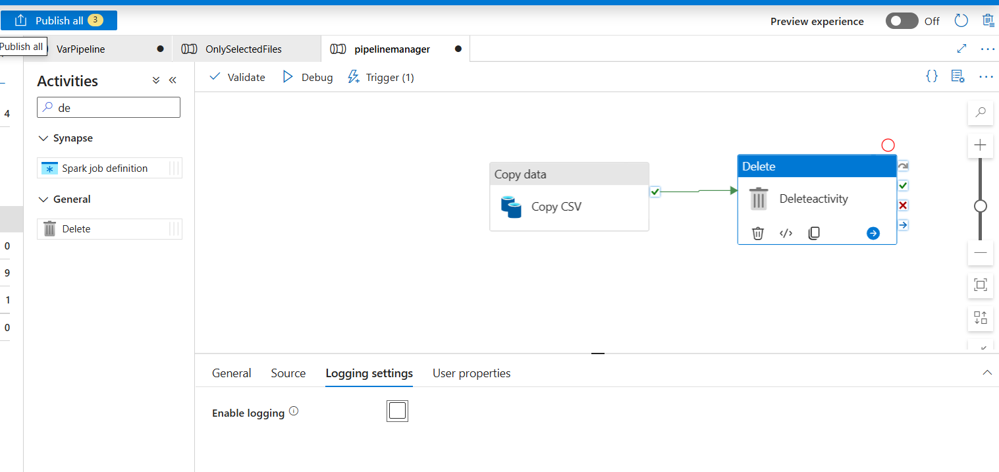
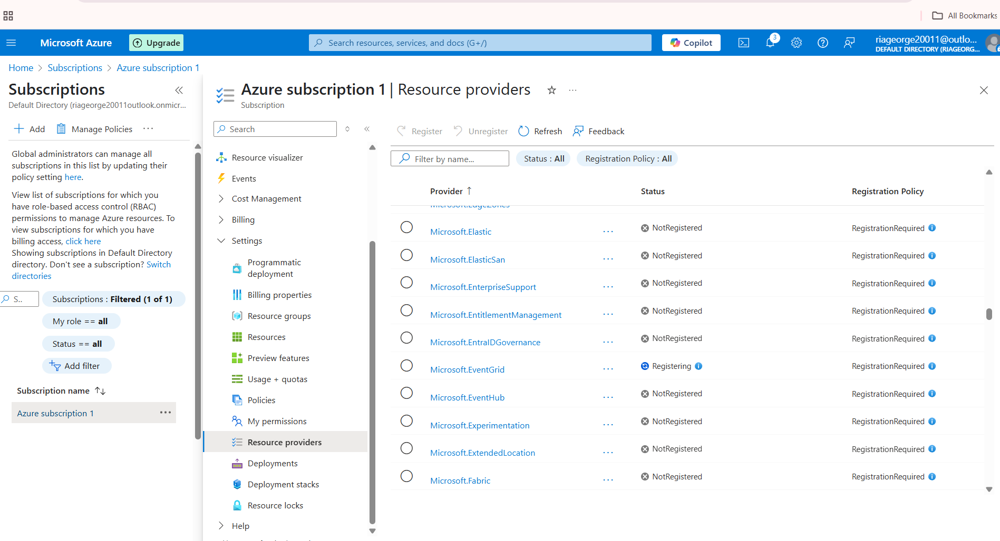

## 📌 Advanced Activities & Real-Time Use Cases (Part 1)

### 🔁 Set Variable Activity 
- Used to store temporary values during pipeline execution.
- Can be defined at pipeline level.
- Set inside **Set Variable Activity** or within expressions.
- **Common Use:** Store folder names, filenames, flags, or counters.
-  GetMetadata output can be stored in a variable. 
- Can perform dynamic content on this set variable activity.
---

### 🔔 Storage Event Trigger 
- **Event-based trigger** that activates pipeline on file arrival/modification.
- Connected to Azure Blob Storage containers.
- Requires **Storage Events** to be enabled.
- Use when:
  - A new `.csv` or `.json` file arrives.
  - Automating ingestion without manual scheduling.
- Once the file is successfully copied , we need to delete the file to avoid continuous copying/trigger.

---

### 🧹 Delete Activity in ADF 
- Deletes files/folders in a blob storage/container.
- Useful to clean up temporary or intermediate files post-processing.
- Requires proper **linked service** + **dataset**.
- **Safety Tip:** Always test on dummy data to avoid accidental loss.

---

### 📊 Real-Time Scenarios in ADF 
-
- End-to-End Data Movement from API/File to Data Lake → Transform → Load.
- **Common Examples:**
  - Pulling GitHub data using HTTP linked service.
  - Filtering files with `Get Metadata` and `If Condition`.
  - Transforming using Data Flows.
  - Writing clean output to target containers.
- Emphasizes **modularity** using **Execute Pipeline** and **Reusability**.

---
## 🔁 Workflow Screenshot

 **A) SET VARIABLE PIPELINE**
 ---

- In a new pipeline [VarPipeline], copy the Get MetadATA activity of previous pipeline (similar logic- startswith `Fact`)
- Click on the canvas -> Variables tab -> create a new variable of datatype array(var_files)

- Drag a new **Set Variable Activity** onto the canvas and connect it to **Metadata Activity**
- Inside settings ->Select var_files variable created ->This will store the file name. Select Pipeline variable

        - Pipeline variable vs Pipeline return value

          

- **Metadata JSON File** : [lesson5-metadata-output.json](./lesson5-metadata-output.json)

- **JSON File for Set Activity - StoreFiles**: [`StoreFiles_St_activity.json`](./StoreFiles_St_activity.json)
 ---

  **B) STORAGE EVENTS TRIGGER**

 # Suppose manager drops a file in /source/csvfiles and the pipeline involved is `pipelinemanager`.Thus attach storage trigger to this pipeline

 

 *Writing complete `Blob path begins with` ensures only the right file is copied *

 
 *Ensures trigger happens only when blob file is uploaded*

 # Delete Activity

 

 *Disable logging*

 

 *For special triggers , we need to register our subscription for that particular storage trigger*

 

 subscriptions ->Settings ->Resource providers ->Microsoft.eventgrid ->3 dots -> register

---
